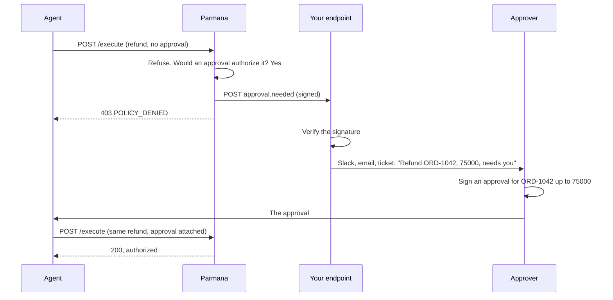

When an agent sends a request that a policy authorizes only with a signed approval, such as a
refund that needs a manager, Parmana refuses it and the agent must send a new request with the
approval attached. Approval notifications tell the approver right away. Parmana sends a signed
`approval.needed` event to a URL you choose, with exactly what the approver needs to sign.



## When an event is sent

Parmana sends one event when all of these hold:

1. The request was refused by the policy's own rules, or because an attached approval did not
   verify.
2. The policy declares `approvalSignals`.
3. Evaluating the same policy, with every declared approval signal set to `true`, authorizes
   the request.

The third condition means an event only goes out when an approval would actually help. A refund
refused for a failed fraud check, or above the policy's maximum, sends nothing, because a
manager's signature would not change the outcome. Requests refused before the policy runs, such
as a bad API key or a request whose signals do not match its own parameters, send nothing.

## Set it up

<Steps>
  <Step title="Create an endpoint">
    Any HTTPS endpoint that accepts a JSON `POST` and answers `2xx` within 3 seconds: a small
    function of your own, a Slack workflow webhook behind a relay, or an automation service.
  </Step>
  <Step title="Generate a secret">
    ```bash
    openssl rand -hex 32
    ```
    Store it where your endpoint can read it. You will verify every event with it.
  </Step>
  <Step title="Configure Parmana">
    Set both variables on the deployment, then redeploy:

    ```bash
    APPROVAL_WEBHOOK_URL=https://hooks.example.com/parmana-approvals
    APPROVAL_WEBHOOK_SECRET=<the secret>
    ```

    With `PARMANA_SECRETS_PROVIDER=aws-secrets-manager`, `APPROVAL_WEBHOOK_SECRET` is the name or
    ARN of the secret instead of its value. Setting only one of the two stops the server at
    startup. The URL must be `https` outside `NODE_ENV=test` and `development`.

  </Step>
  <Step title="Send a test request">
    Send a request the policy refuses only for want of an approval, for example a refund with
    `managerApproved: false` and every other fact true. Your endpoint receives an event.
  </Step>
</Steps>

## The event

```json
{
  "type": "approval.needed",
  "occurredAt": "2026-09-29T10:15:02.114Z",
  "businessTransactionId": "5f0c2a7e-3d7b-4d0e-9a55-2f6d8b1c4e90",
  "decisionId": "a91e6c1d-0b8f-4f3a-8e57-6f2d1c9b7a44",
  "action": "paytm:refund",
  "target": "paytm://orders/ORD-1042",
  "policyId": "customer-refund",
  "policyVersion": "1.2.0",
  "reason": "No rule matched.",
  "submittedBy": "refund-agent",
  "approvals": [
    { "signal": "managerApproved", "resourceId": "ORD-1042", "value": 75000 }
  ]
}
```

<ResponseField name="type" type="string" required>
  Always `approval.needed`.
</ResponseField>

<ResponseField name="occurredAt" type="string" required>
  When the request was refused, ISO 8601 UTC.
</ResponseField>

<ResponseField name="businessTransactionId" type="string" required>
  The refused request. Its Refusal Record has the full decision.
</ResponseField>

<ResponseField name="decisionId" type="string" required>
  The refusal decision.
</ResponseField>

<ResponseField name="action" type="string" required>
  The action that needs approval, such as `paytm:refund`. Sign with this as
  `capability`.
</ResponseField>

<ResponseField name="target" type="string" required>
  The request's target.
</ResponseField>

<ResponseField name="policyId" type="string" required>
  The policy that refused it.
</ResponseField>

<ResponseField name="policyVersion" type="string" required>
  Its version.
</ResponseField>

<ResponseField name="reason" type="string">
  The refusal reason from the policy.
</ResponseField>

<ResponseField name="submittedBy" type="string">
  The caller that sent the request, when known.
</ResponseField>

<ResponseField name="approvals" type="object[]" required>
  One entry per approval the policy declares.

  <Expandable title="properties">
    <ResponseField name="signal" type="string" required>
      The approval signal, such as `managerApproved`. The agent sets it to `true` on the new
      request.
    </ResponseField>
    <ResponseField name="resourceId" type="string">
      What the approval must name, read from the request at the policy's `resourceId` path. Sign
      with this as `resourceId`. Absent if the request did not carry it.
    </ResponseField>
    <ResponseField name="value" type="number">
      The amount the approval must cover, read at the policy's `value` path. Sign with at least
      this as the maximum amount. Absent when the policy declares no amount.
    </ResponseField>
  </Expandable>
</ResponseField>

The event carries only what the approver needs. Other request parameters and signals are not
sent; look them up by `businessTransactionId` if you need them.

## Verify the signature

Every event has two headers:

| Header                      | Value                                                                                      |
| --------------------------- | ------------------------------------------------------------------------------------------ |
| `parmana-webhook-timestamp` | Unix seconds when it was sent                                                              |
| `parmana-webhook-signature` | `v1=` and the lowercase hex HMAC SHA256 of `<timestamp>.<raw body>`, keyed with the secret |

Verify against the raw request body, before parsing it, compare in constant time, and refuse a
timestamp more than 5 minutes old so a captured event cannot be replayed later.

<CodeGroup>

```typescript Node.js
import { createHmac, timingSafeEqual } from "node:crypto";
import express from "express";

const app = express();

app.post(
  "/parmana-approvals",
  express.raw({ type: "application/json" }),
  (req, res) => {
    const timestamp = req.header("parmana-webhook-timestamp") ?? "";
    const signature = req.header("parmana-webhook-signature") ?? "";
    const body = req.body.toString("utf8");

    const expected =
      "v1=" +
      createHmac("sha256", process.env.APPROVAL_WEBHOOK_SECRET!)
        .update(`${timestamp}.${body}`)
        .digest("hex");

    const fresh = Math.abs(Date.now() / 1000 - Number(timestamp)) < 300;
    const valid =
      expected.length === signature.length &&
      timingSafeEqual(Buffer.from(expected), Buffer.from(signature));

    if (!fresh || !valid) {
      res.status(400).end();
      return;
    }

    const event = JSON.parse(body);
    // Hand off to a queue or notify the approver, then answer fast.
    res.status(204).end();
  },
);
```

```python Python
import hashlib
import hmac
import json
import os
import time

from flask import Flask, abort, request

app = Flask(__name__)
SECRET = os.environ["APPROVAL_WEBHOOK_SECRET"].encode()


@app.post("/parmana-approvals")
def approvals():
    timestamp = request.headers.get("parmana-webhook-timestamp", "")
    signature = request.headers.get("parmana-webhook-signature", "")
    body = request.get_data()  # raw bytes, before parsing

    expected = "v1=" + hmac.new(
        SECRET, timestamp.encode() + b"." + body, hashlib.sha256
    ).hexdigest()

    fresh = timestamp.isdigit() and abs(time.time() - int(timestamp)) < 300
    if not fresh or not hmac.compare_digest(expected, signature):
        abort(400)

    event = json.loads(body)
    # Hand off to a queue or notify the approver, then answer fast.
    return "", 204
```

</CodeGroup>

## From event to approval

The approver signs exactly what the event names:

<CodeGroup>

```bash Script
npx tsx scripts/sign-approval.ts \
  --private-key-file ~/.parmana/manager-priya__manager-priya-key-1.private.pem \
  --approver-id manager-priya --key-id manager-priya-key-1 \
  --capability "$ACTION" --resource-id "$RESOURCE_ID" --max-amount "$VALUE" \
  --out approval.json
```

```typescript TypeScript
import { signApproval } from "@parmana/sdk";

const [needed] = event.approvals;
const approval = signApproval({
  privateKeyPem,
  approverId: "manager-priya",
  keyId: "manager-priya-key-1",
  capability: event.action,
  resourceId: needed.resourceId,
  ...(needed.value !== undefined ? { maxAmount: needed.value } : {}),
});
```

```python Python
from parmana.crypto import sign_approval

needed = event["approvals"][0]
approval = sign_approval(
    private_key_pem=private_key_pem,
    approver_id="manager-priya",
    key_id="manager-priya-key-1",
    capability=event["action"],
    resource_id=needed["resourceId"],
    max_amount=needed.get("value"),
)
```

</CodeGroup>

The agent then sends a new request, with a new `businessTransactionId`, the approval signal set
to `true`, and the approval in `signals.approvalArtifact`. See
[Human approval](/concepts/human-approval#approve-a-refund).

<Warning>
  An event says a request is waiting. It is not an instruction to approve it.
  The approver decides, on their own machine, with their own key; your endpoint
  should never sign approvals automatically.
</Warning>

## Delivery

| Behavior   | Detail                                                                                                                  |
| ---------- | ----------------------------------------------------------------------------------------------------------------------- |
| Attempts   | One. There is no retry.                                                                                                 |
| Timeout    | 3 seconds. Answer quickly and do slow work afterwards.                                                                  |
| Success    | Any `2xx`. Anything else, a timeout, a redirect, or a network error is logged as `approval_needed_notification_failed`. |
| Effect     | None on the request. It is refused either way, and the agent's response is the same.                                    |
| Ordering   | Events are sent in the order requests are refused, but may arrive out of order.                                         |
| Duplicates | Each refused request sends at most one event. An agent that retries sends one per request.                              |

Because delivery is best effort, the Refusal Records remain the complete list of waiting
requests. For a daily sweep, see [Review refused requests](/concepts/human-approval#review-refused-requests).

## Test locally

Point the webhook at a local listener and run Parmana in development:

```bash
NODE_ENV=development \
APPROVAL_WEBHOOK_URL=http://127.0.0.1:4000/parmana-approvals \
APPROVAL_WEBHOOK_SECRET=local-test-secret \
npm run dev
```

`http` is accepted only in `development` and `test`.

## Reference

| Variable                  | Required        | Description                                                  |
| ------------------------- | --------------- | ------------------------------------------------------------ |
| `APPROVAL_WEBHOOK_URL`    | With the secret | Where events are sent. `https` outside development and test. |
| `APPROVAL_WEBHOOK_SECRET` | With the URL    | HMAC key, or a secret reference with a secrets provider.     |

See also [Environment variables](/deployment/environment-variables#approval-notifications).
