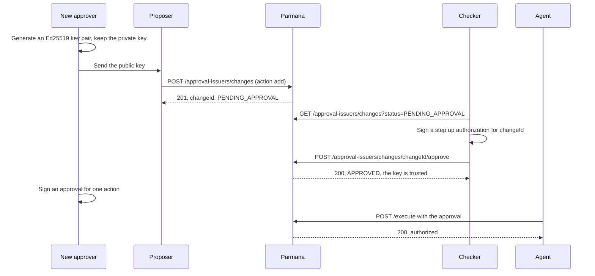

A policy with `approvalSignals` accepts an action only with a signed approval from a trusted
approver key, such as a manager approving a refund. This guide shows how to trust a new
approver key, rotate one, and revoke one, through the API. Each change is proposed by one
person and approved by a different person with a step up signature, and it takes effect on
the next request. Nothing is deployed.

<Info>
  Approvers added this way are stored in the `approval_issuers` table. Approvers
  listed in the server code (`createApprovalIssuerRegistry.ts`) still work, and
  are shown by the same list call, but they change only with a pull request and
  a deploy.
</Info>

## How it works



| Rule                                    | What the server does                                                                  |
| --------------------------------------- | ------------------------------------------------------------------------------------- |
| Only people change approvers            | Every call needs an API key added as a human (`credentialHolderType USER`)            |
| The proposer is never the checker       | `403 SAME_ACTOR_CANNOT_APPROVE_OWN_CHANGE`, in the API and in the database            |
| Approve and reject need fresh intent    | A step up authorization for this change and this action, valid once, 120 seconds      |
| One open change per approver key        | A second proposal for the same key is `409 CONFLICT` until the first is resolved      |
| Approving applies the change atomically | The key is added or revoked and the change resolved in one database transaction       |
| A change takes effect at once           | The next approval checked reads the table; nothing is cached                          |
| Nothing is deleted                      | A revoked key stays listed, so every approval it ever signed can still be explained   |
| Key ids are used once                   | A key id that exists, revoked or not, cannot be added again: rotate with a new key id |
| Failures refuse                         | If the table cannot be read, the approver is unknown and the approval is refused      |

## Before you begin

You need three people, or at least three roles:

- **The new approver**, who will sign approvals. They make their own key pair and never share
  the private key.
- **A proposer** with an API key added as a human.
- **A checker**, a different person, with an API key added as a human and a registered step up
  key. This is the same setup policy approvals use: see
  [Policy lifecycle and approvals](/guides/policy-lifecycle-and-approvals#2-set-up-the-people-once).

The deployment needs the migration `20260929120000_add_approval_issuers.sql`. Self hosted
deployments apply it on start. Otherwise run `npm run db:migrate -- apply` before deploying
this version, as in [Production deployment, step 2](/deployment/production#step-2-create-the-database-schema).

## Step 1: The approver makes a key pair

On the approver's own machine:

```bash
npx tsx scripts/generate-approver-key.ts \
  --approver-id manager-priya \
  --key-id manager-priya-key-1 \
  --out-dir ~/.parmana
```

This writes `manager-priya__manager-priya-key-1.private.pem`, which stays on that machine, and
`manager-priya__manager-priya-key-1.public.pem`, which they send to the proposer. Any Ed25519
key works; `openssl genpkey -algorithm ed25519` makes one too.

`approverId` and `keyId` are the names the approver will put in every approval they sign. Use
letters, digits, `.`, `_` and `-`, at most 128 characters. Put a number in the key id, so a
later key can have the next one.

## Step 2: Propose adding the key

<CodeGroup>

```bash curl
curl -X POST "$PARMANA_URL/approval-issuers/changes" \
  -H "Authorization: Bearer $PROPOSER_KEY" \
  -H "Content-Type: application/json" \
  --data "$(jq -n --rawfile pem manager-priya__manager-priya-key-1.public.pem '{
    action: "add",
    approverId: "manager-priya",
    keyId: "manager-priya-key-1",
    publicKeyPem: $pem,
    reason: "Priya approves refunds for the West region from October."
  }')"
```

```typescript TypeScript
import { readFileSync } from "node:fs";
import { ParmanaClient } from "@parmana/sdk";

const proposer = new ParmanaClient({
  endpoint: process.env.PARMANA_URL!,
  apiKey: process.env.PROPOSER_KEY,
});

const change = await proposer.proposeApproverChange({
  action: "add",
  approverId: "manager-priya",
  keyId: "manager-priya-key-1",
  publicKeyPem: readFileSync(
    "manager-priya__manager-priya-key-1.public.pem",
    "utf8",
  ),
  reason: "Priya approves refunds for the West region from October.",
});

console.log(change.changeId); // send this to the checker
```

```python Python
import os
from pathlib import Path
from parmana import ParmanaClient

proposer = ParmanaClient(endpoint=os.environ["PARMANA_URL"], api_key=os.environ["PROPOSER_KEY"])

change = proposer.approvers.propose_add(
    approver_id="manager-priya",
    key_id="manager-priya-key-1",
    public_key_pem=Path("manager-priya__manager-priya-key-1.public.pem").read_text(),
    reason="Priya approves refunds for the West region from October.",
)

print(change.change_id)  # send this to the checker
```

</CodeGroup>

The response is the change, waiting for a checker:

```json 201 Created
{
  "changeId": "ba7c5827-5844-4069-94fc-9b438ef08f78",
  "action": "add",
  "approverId": "manager-priya",
  "keyId": "manager-priya-key-1",
  "publicKeyPem": "-----BEGIN PUBLIC KEY-----\nMCowBQYDK2VwAyEAEDuWHf+bbRY7J/Mr0RVmAKYHH5CDijTWhdnISXWLD6Y=\n-----END PUBLIC KEY-----\n",
  "reason": "Priya approves refunds for the West region from October.",
  "proposedBy": "human-maker",
  "proposedAt": "2026-09-28T19:05:59.726Z",
  "status": "PENDING_APPROVAL"
}
```

The server stores the key in canonical PEM. A key that is not Ed25519 is refused with `400`.

## Step 3: The checker reviews it

<CodeGroup>

```bash curl
curl "$PARMANA_URL/approval-issuers/changes?status=PENDING_APPROVAL" \
  -H "Authorization: Bearer $CHECKER_KEY"
```

```typescript TypeScript
const pending = await checker.approverChanges("PENDING_APPROVAL");
```

```python Python
pending = checker.approver_changes("PENDING_APPROVAL")
```

</CodeGroup>

Check the approver and key id, the reason, and that the public key is the one the approver
sent you, compared over a channel other than the one the proposer used.

## Step 4: The checker approves it

The checker signs a step up authorization on their own machine, naming this change and the
action, and sends it with the approval. It is the same step up authorization policy changes
use: the change id goes in `pendingPolicyChangeId`.

<CodeGroup>

```bash curl
npx tsx scripts/sign-policy-change-step-up.ts \
  --private-key-file ~/.parmana/step-up.private.pem \
  --key-id checker-step-up-1 \
  --pending-policy-change-id ba7c5827-5844-4069-94fc-9b438ef08f78 \
  --action approve > step-up.json

curl -X POST "$PARMANA_URL/approval-issuers/changes/ba7c5827-5844-4069-94fc-9b438ef08f78/approve" \
  -H "Authorization: Bearer $CHECKER_KEY" \
  -H "Content-Type: application/json" \
  --data "{\"stepUpAuthorization\": $(cat step-up.json)}"
```

```typescript TypeScript
import { readFileSync } from "node:fs";
import { ParmanaClient, signPolicyChangeStepUp } from "@parmana/sdk";

const checker = new ParmanaClient({
  endpoint: process.env.PARMANA_URL!,
  apiKey: process.env.CHECKER_KEY,
});

const approved = await checker.approveApproverChange(
  changeId,
  signPolicyChangeStepUp({
    pendingPolicyChangeId: changeId,
    action: "approve",
    privateKeyPem: readFileSync("step-up.private.pem", "utf8"),
    keyId: "checker-step-up-1",
  }),
);
```

```python Python
from pathlib import Path
from parmana.crypto import sign_policy_change_step_up

approved = checker.approve_approver_change(
    change_id,
    sign_policy_change_step_up(
        pending_policy_change_id=change_id,
        action="approve",
        private_key_pem=Path("step-up.private.pem").read_text(),
        key_id="checker-step-up-1",
    ),
)
```

</CodeGroup>

```json 200 OK
{
  "changeId": "ba7c5827-5844-4069-94fc-9b438ef08f78",
  "action": "add",
  "approverId": "manager-priya",
  "keyId": "manager-priya-key-1",
  "status": "APPROVED",
  "proposedBy": "human-maker",
  "resolvedBy": "human-checker",
  "resolvedAt": "2026-09-28T19:05:59.738Z",
  "...": "..."
}
```

From the next request on, approvals signed with `manager-priya-key-1` verify.

## Step 5: Confirm the key is trusted

<CodeGroup>

```bash curl
curl "$PARMANA_URL/approval-issuers" -H "Authorization: Bearer $CHECKER_KEY"
```

```typescript TypeScript
const approvers = await checker.approvers();
```

```python Python
approvers = checker.list_approvers()
```

</CodeGroup>

```json 200 OK
{
  "issuers": [
    {
      "approverId": "manager-charak1987",
      "keyId": "manager-charak1987-key-1",
      "revoked": false,
      "source": "code",
      "publicKeyPem": "-----BEGIN PUBLIC KEY-----\n..."
    },
    {
      "approverId": "manager-priya",
      "keyId": "manager-priya-key-1",
      "revoked": false,
      "source": "governed",
      "addedByChangeId": "ba7c5827-5844-4069-94fc-9b438ef08f78",
      "addedAt": "2026-09-28T19:05:59.738Z",
      "publicKeyPem": "-----BEGIN PUBLIC KEY-----\n..."
    }
  ]
}
```

The approver can now sign approvals, with `scripts/sign-approval.ts`, `signApproval()` or
`parmana.crypto.sign_approval()`. See [Human approval](/concepts/human-approval).

## Rotate a key

Key ids are used once, so a rotation is two changes:

1. The approver makes a new key pair with the next key id, such as `manager-priya-key-2`.
2. Propose and approve adding it (Steps 2 to 4).
3. The approver signs new approvals with the new key.
4. Propose and approve revoking the old key (below).

Approvals signed with the old key keep working until step 4. Approvals are valid for 15 minutes
by default, so revoking a few minutes after the switch refuses none that are in use.

## Revoke a key

Revoke when an approver leaves the role, or a private key may be exposed. Once the revocation is
approved, every approval the key ever signed is refused, including ones not used yet.

<CodeGroup>

```bash curl
curl -X POST "$PARMANA_URL/approval-issuers/changes" \
  -H "Authorization: Bearer $PROPOSER_KEY" \
  -H "Content-Type: application/json" \
  --data '{"action":"revoke","approverId":"manager-priya","keyId":"manager-priya-key-1","reason":"Priya moved to another team."}'
```

```typescript TypeScript
const revoke = await proposer.proposeApproverChange({
  action: "revoke",
  approverId: "manager-priya",
  keyId: "manager-priya-key-1",
  reason: "Priya moved to another team.",
});
```

```python Python
revoke = proposer.approvers.propose_revoke(
    approver_id="manager-priya",
    key_id="manager-priya-key-1",
    reason="Priya moved to another team.",
)
```

</CodeGroup>

A checker then approves it as in Step 4. Only keys added through approver changes can be
revoked this way; a key in the server code is revoked by setting `revoked: true` there and
deploying.

<Warning>
  A revocation needs a second person, like every change. If a private key is exposed and no
  checker can be reached, an operator with database access can revoke it directly. This skips
  maker checker, so the change row must name who did it and why:

```sql
begin;
insert into approval_issuer_changes
  (change_id, action, approver_id, key_id, reason, proposed_by, proposed_at,
   status, resolved_by, resolved_at)
values
  ('emergency-2026-10-01-1', 'revoke', 'manager-priya', 'manager-priya-key-1',
   'Emergency: private key exposed. Done at the database by the operator.',
   'operator-a', now(), 'APPROVED', 'operator-b', now());
update approval_issuers
set revoked = true, revoked_by_change_id = 'emergency-2026-10-01-1', revoked_at = now()
where approver_id = 'manager-priya' and key_id = 'manager-priya-key-1' and revoked = false;
commit;
```

</Warning>

## Reject a change

<CodeGroup>

```bash curl
curl -X POST "$PARMANA_URL/approval-issuers/changes/$CHANGE_ID/reject" \
  -H "Authorization: Bearer $CHECKER_KEY" \
  -H "Content-Type: application/json" \
  --data "{\"rejectionReason\": \"Priya stays on refunds until 31 October.\", \"stepUpAuthorization\": $(cat step-up-reject.json)}"
```

```typescript TypeScript
await checker.rejectApproverChange(
  changeId,
  "Priya stays on refunds until 31 October.",
  signPolicyChangeStepUp({
    pendingPolicyChangeId: changeId,
    action: "reject",
    privateKeyPem,
    keyId,
  }),
);
```

```python Python
checker.reject_approver_change(
    change_id,
    "Priya stays on refunds until 31 October.",
    sign_policy_change_step_up(
        pending_policy_change_id=change_id, action="reject", private_key_pem=pem, key_id=key_id
    ),
)
```

</CodeGroup>

A rejection changes no key. The change keeps its `rejectionReason`.

## Errors

| Status | Code                                   | When                                                                                                                          | What to do                                                                  |
| ------ | -------------------------------------- | ----------------------------------------------------------------------------------------------------------------------------- | --------------------------------------------------------------------------- |
| 400    | none                                   | `action` is not `add` or `revoke`, an id has other characters, `reason` is missing, or `publicKeyPem` is not an Ed25519 key   | Fix the request. The message names the field.                               |
| 401    | `UNAUTHORIZED`                         | No API key, or an unknown one                                                                                                 | Send `Authorization: Bearer <key>`.                                         |
| 403    | `NON_HUMAN_CALLER_DENIED`              | The API key is not added as a human                                                                                           | Use a person's key, not an agent's.                                         |
| 403    | `SAME_ACTOR_CANNOT_APPROVE_OWN_CHANGE` | The checker is the proposer                                                                                                   | A different person approves.                                                |
| 403    | `STEP_UP_AUTHORIZATION_INVALID`        | No step up, or one that is expired, reused, for another change or action, or signed with a key not registered to this checker | Sign a new one for this change id and action, and send it within 2 minutes. |
| 404    | `APPROVAL_ISSUER_CHANGE_NOT_FOUND`     | No change has this id                                                                                                         | Check the id from the proposal.                                             |
| 409    | `CONFLICT`                             | The key is in code, already exists, is not active (revoke), another change for it is pending, or the change is resolved       | Read the message. Use a new key id to add a key again.                      |

## Reference

- API: [List approver keys](/api-reference/endpoints/list-approval-issuers),
  [Propose](/api-reference/endpoints/propose-approval-issuer-change),
  [List changes](/api-reference/endpoints/list-approval-issuer-changes),
  [Approve](/api-reference/endpoints/approve-approval-issuer-change),
  [Reject](/api-reference/endpoints/reject-approval-issuer-change).
- Tables: [`approval_issuers` and `approval_issuer_changes`](/storage/schema-reference#approval_issuers-and-approval_issuer_changes).
- The server logs `approval_issuer_change_approved` for every approved change, and
  `approval_issuer_lookup_failed` when the table could not be read during a check.
