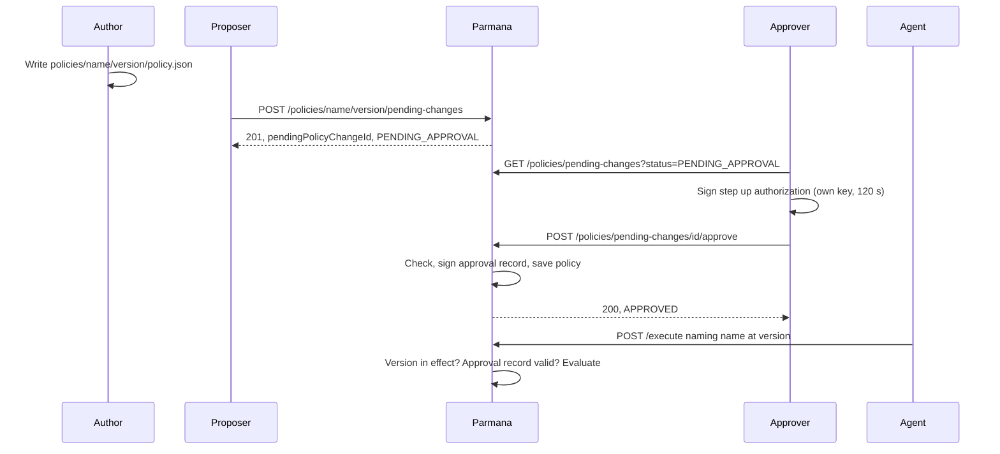
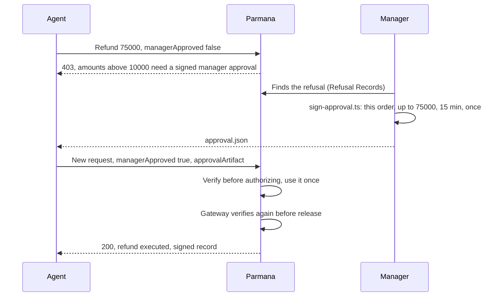

A policy authorizes nothing until one person proposes it and a different person approves it with a signed step up authorization. Once approved, it is the version in effect for its action, with no deploy. Separately, a policy can say that some actions also need a named person's signed approval each time they run. This page covers both, in the order you do them.

## Who does what

| Role               | What they do                          | What they hold                                                        |
| ------------------ | ------------------------------------- | --------------------------------------------------------------------- |
| Author             | Writes the policy file                | A clone of the repository                                             |
| Proposer (maker)   | Sends the policy for approval         | An API key added as a human (`credentialHolderType USER`)             |
| Approver (checker) | Reviews and approves or rejects it    | Their own API key added as a human, and their own step up private key |
| Operator           | Adds API keys, approver keys, deploys | Access to the deployment                                              |
| Agent              | Sends requests that name the policy   | A service API key                                                     |
| Action approver    | Signs off on one critical action      | Their own approval private key                                        |

The proposer and the approver must be two different people. The server refuses an approval from the proposer's API key, but it cannot tell whether two keys belong to two people: keep each key on its owner's machine.

## Part 1: from a policy file to a policy in effect



### 1. Write the policy

A policy is a JSON file at `policies/<name>/<version>/policy.json`: `policyId`, `policyVersion`, `schemaVersion`, and ordered `rules`, where the first matching rule decides. See [Write your first policy](/guides/write-your-first-policy) for rules and operators. Three optional sections tie signals to reality:

- `boundSignals`: a signal must equal a field of the request, such as `"refundAmount": "parameters.amount"`.
- `unboundSignalReasons`: why a signal the rules read is not bound. Every fact a rule reads must be bound, declared as an approval signal, or given a reason here, or the policy is refused.
- `approvalSignals`: signals that count as `true` only with a person's signed approval (Part 2).

A new version of a live policy is a new folder, such as `customer-refund/1.2.0`, never an edit of an approved one. Check it before proposing: `npx vitest run packages/policy/tests/unit/ReferencePolicies.test.ts` validates every policy file under `policies/`.

### 2. Set up the people, once

- **Proposer and approver API keys**, each added as a human. On a self hosted deployment: [Manage API keys](/self-hosted/api-keys). Anything else gets `403 NON_HUMAN_CALLER_DENIED` on every governance call.
- **The approver's step up key**, made on the approver's own machine. Only the public half goes to the operator:

```bash
openssl genpkey -algorithm ed25519 -out step-up.private.pem
openssl pkey -in step-up.private.pem -pubout -out step-up.public.pem
```

The operator registers `step-up.public.pem` on the approver's API key and deploys.

### 3. Propose

The request carries the whole policy and a reason. The name and version in the URL must match `policyId` and `policyVersion` in the content, and the content must pass validation.

<CodeGroup>

```bash Bash
export PARMANA_URL=https://your-parmana-host
export PROPOSER_KEY=<the proposer's API key>

printf '{"reason":"Why this should take effect.","proposedContent":%s}' \
  "$(cat policies/customer-refund/1.1.0/policy.json)" > proposal.json

curl -s -X POST $PARMANA_URL/policies/customer-refund/1.1.0/pending-changes \
  -H "Authorization: Bearer $PROPOSER_KEY" -H "Content-Type: application/json" \
  --data @proposal.json
```

```powershell PowerShell
$url = "https://your-parmana-host"
$key = [Runtime.InteropServices.Marshal]::PtrToStringAuto([Runtime.InteropServices.Marshal]::SecureStringToBSTR((Read-Host "Proposer API key" -AsSecureString)))
$policy = Get-Content policies/customer-refund/1.1.0/policy.json -Raw
$body = '{"reason":"Why this should take effect.","proposedContent":' + $policy + '}'
$r = Invoke-RestMethod -Method Post -Uri "$url/policies/customer-refund/1.1.0/pending-changes" `
  -Headers @{ Authorization = "Bearer $key" } -ContentType "application/json" `
  -Body ([System.Text.Encoding]::UTF8.GetBytes($body))
$r.pendingPolicyChangeId
```

</CodeGroup>

The response is `201` with a `pendingPolicyChangeId` and status `PENDING_APPROVAL`. Only one open proposal per policy version is allowed; a second gets `409 CONFLICT`. Send the id to the approver.

### 4. Review

The approver lists what is waiting and reads the proposed content before signing:

```bash
curl -s "$PARMANA_URL/policies/pending-changes?status=PENDING_APPROVAL" \
  -H "Authorization: Bearer $APPROVER_KEY"
```

### 5. Approve or reject

The approver signs a step up authorization for this one change and this one action, on their own machine, then sends it within its lifetime (120 seconds at most). The SDKs sign too: `signPolicyChangeStepUp()` in TypeScript, `sign_policy_change_step_up()` in Python.

<CodeGroup>

```bash Bash
export CHANGE_ID=<the pendingPolicyChangeId>

npx tsx scripts/sign-policy-change-step-up.ts \
  --private-key-file step-up.private.pem --key-id <approver caller id> \
  --pending-policy-change-id "$CHANGE_ID" --action approve > signed.txt

curl -s -X POST $PARMANA_URL/policies/pending-changes/$CHANGE_ID/approve \
  -H "Authorization: Bearer $APPROVER_KEY" -H "Content-Type: application/json" \
  -d "{\"stepUpAuthorization\":$(grep '^{' signed.txt)}"
```

```powershell PowerShell
$changeId = "<the pendingPolicyChangeId>"
$stepUp = npx tsx scripts/sign-policy-change-step-up.ts --private-key-file step-up.private.pem `
  --key-id <approver caller id> --pending-policy-change-id $changeId --action approve | Where-Object { $_ -like '{*' }
$body = '{"stepUpAuthorization":' + $stepUp + '}'
Invoke-RestMethod -Method Post -Uri "$url/policies/pending-changes/$changeId/approve" `
  -Headers @{ Authorization = "Bearer $key" } -ContentType "application/json" `
  -Body ([System.Text.Encoding]::UTF8.GetBytes($body))
```

</CodeGroup>

To reject, sign with `--action reject` and post to `.../reject` with a `rejectionReason`.

On approve, the server does this, in order, and stops at the first failure:

1. The caller is a verified human, or `403 NON_HUMAN_CALLER_DENIED`.
2. The change exists, or `404 PENDING_POLICY_CHANGE_NOT_FOUND`.
3. The caller is not the proposer, or `403 SAME_ACTOR_CANNOT_APPROVE_OWN_CHANGE`.
4. The step up authorization is valid for this change and action, signed by the key registered for this caller, not expired, not used before, or `403 STEP_UP_AUTHORIZATION_INVALID`.
5. It writes a signed approval record: who proposed, who approved, when, the content hash before and after, and the hash of the previous record for this policy version, so records form a chain.
6. It saves the policy content and marks the change `APPROVED`.

### 6. It takes effect

For an action bound to a policy (such as `paytm:refund` to `customer-refund`), the version in effect is the one with the most recent approval, so the approval is the release: no deploy. From then on:

- Agents must name that version. A request naming any other version, including an older one that was approved before, is refused before any rule runs, with a message naming the version in effect.
- To roll back, approve the older version again. The newest approval wins.

Binding an action to a different policy name, or adding a new action, still needs a code change and a deploy.

### 7. What is checked on every request

- The version named is the version in effect for the action.
- The loaded policy has an approval record, the record's signature verifies, and its content hash equals the live policy's. Anything else refuses the request, so a policy edited in the database outside this flow cannot authorize anything.
- The gateway checks the approval record again just before release.
- At startup, the server checks every policy against its latest approval record and logs the result.

These checks are on whenever `NODE_ENV` is anything other than `test` or `development`, and nothing switches them off in production. In `test` or `development` they are off unless `POLICY_EXECUTION_VERIFICATION_ENFORCED=true`. So approve every policy a deployment executes against **before** promoting it; a policy still `PENDING_APPROVAL`, or rejected with no approved replacement, is refused on the first request.

### 8. Check what is approved

`content_hash_after` is a hash of the canonical JSON (keys sorted), not of the file bytes, so a plain file hash will not match. Use the script that compares every policy on disk with its latest approval record:

```bash
npx tsx scripts/verify-policy-changes-approved.ts --full-scan
```

The CI job `verify-policy-approvals` runs the same check for policy files changed in a push or pull request. A rejection writes no approval record: the change's `rejectionReason` is the record it leaves.

### Sign and submit in one step

Signing and sending by hand leaves a gap in which the 120 second step up lifetime can run out. `scripts/local-review-action.ts` signs and submits in one process, on the approver's own machine:

```powershell
$env:REVIEWER_KEY = [Runtime.InteropServices.Marshal]::PtrToStringAuto([Runtime.InteropServices.Marshal]::SecureStringToBSTR((Read-Host "Approver API key" -AsSecureString)))
npx tsx scripts/local-review-action.ts --pending-policy-change-id <id> --action approve `
  --private-key-file <path to your step-up.private.pem> --key-id <your caller id> `
  --api-base https://your-parmana-host
```

Always pass `--private-key-file`, `--key-id` and `--api-base`: the defaults name a local file, a caller id and a host from this project's own setup. The script prints the HTTP status and response only, never a key.

`scripts/refresh-approved-policy-content.ts` proposes the file on disk and approves it in one run, so it needs both the proposer's and the approver's keys in one process. That is one person acting as both; use it only in a test environment, never where the approval record must stand for a second person.

## Part 2: a person signs off on one action

Some actions need a person each time, such as a refund above 10000. The policy declares which signal needs a signed approval, and where the request says what the approval is for:

```json
"approvalSignals": {
  "managerApproved": { "resourceId": "parameters.orderId", "value": "parameters.amount" }
}
```

`resourceId` is `"target"` or a path into `parameters`; `value` is optional and must point at a number. Without `value`, the approval names exactly one resource, which suits a merge approval (`"resourceId": "target"`, for `acme/api#42`).



### Set up an action approver, once

```bash
npx tsx scripts/generate-approver-key.ts \
  --approver-id manager-priya --key-id manager-priya-key-1 --out-dir ~/.parmana
```

The private key stays on the manager's machine. The operator adds `{ approverId, keyId, revoked: false, publicKeyPem }` to `TRUSTED_APPROVAL_ISSUERS` in `packages/api/src/bootstrap/createApprovalIssuerRegistry.ts`, with the contents of the `.public.pem` file as `publicKeyPem`, and deploys. To revoke, set `revoked: true` and deploy.

### Sign an approval

```bash
npx tsx scripts/sign-approval.ts \
  --private-key-file ~/.parmana/manager-priya__manager-priya-key-1.private.pem \
  --approver-id manager-priya --key-id manager-priya-key-1 \
  --capability paytm:refund --resource-id ORD-1042 --max-amount 75000 --out approval.json
```

The agent sends a new request with the approval signal set to `true` and the contents of `approval.json` in `signals.approvalArtifact`. Parmana checks the approver is trusted and not revoked, the Ed25519 signature, the expiry, the action, the resource and the amount taken from the request, never from the agent's signals, and that the approval was not used before. It checks again at the gateway just before release. Without a valid approval the request is refused:

```text
Execution rejected: Rejected: declared signal(s) do not match independently verified state (managerApproved=true != verified managerApproved=false).
```

To find refusals waiting for a manager, query the Refusal Records for `matchedRuleId = 'reject-manager-approval-required'` (see [Human approval](/concepts/human-approval#review-refused-requests)).

To see the whole flow run, without a server or AWS, run tutorial 119: `npx tsx examples/tutorials/119-human-approval-for-one-action/run.ts`. It uses the real `customer-refund` 1.1.0 policy and shows an automatic refund, a refusal, a refused unsigned claim, a signed approval accepted and checked again before release, and an approval refused when reused, stretched to a larger amount or moved to another order.

## Where it is recorded

| Table                                   | Holds                                                                               |
| --------------------------------------- | ----------------------------------------------------------------------------------- |
| `pending_policy_changes`                | Every proposal, its status, who proposed and who resolved it                        |
| `policy_change_approval_records`        | Signed, chained approval records; the latest per name decides the version in effect |
| `policies`                              | The approved policy content                                                         |
| `consumed_policy_change_step_up_nonces` | Step up authorizations already used                                                 |
| `consumed_approval_nonces`              | Action approvals already used                                                       |
| `refusal_records`                       | Every refused request, signed                                                       |

## Troubleshooting

| You see                                    | Cause                                                                                                                                                           | Fix                                                                                                                                                                                |
| ------------------------------------------ | --------------------------------------------------------------------------------------------------------------------------------------------------------------- | ---------------------------------------------------------------------------------------------------------------------------------------------------------------------------------- |
| `401` `authentication required`            | The API key is missing, wrong or rotated, or the header is not `Authorization: Bearer <key>`                                                                    | Check the variable is set in this terminal (`$env:REVIEWER_KEY.Length` prints a number, not `0`).                                                                                  |
| `403 STEP_UP_AUTHORIZATION_INVALID`        | The signature expired (over 120 seconds), was already used, or was made with a private key that does not match the `stepUpPublicKey` registered for this caller | Sign again and send at once, or use `local-review-action.ts`. If it persists, check your private key matches the registered public key (after a rotation, replace the `.pem` too). |
| `403 SAME_ACTOR_CANNOT_APPROVE_OWN_CHANGE` | The approving API key belongs to the proposer                                                                                                                   | A different person approves with their own key. There is no override.                                                                                                              |
| `403 NON_HUMAN_CALLER_DENIED`              | The API key is not registered as a human (`credentialHolderType USER`)                                                                                          | The operator registers it as a human.                                                                                                                                              |
| `400` naming a field on propose            | The body is malformed, `policyId` does not match the name in the URL, or the version has characters outside `A-Z a-z 0-9 . _ -`                                 | Read the `error` message; it names the field.                                                                                                                                      |
| `400 Malformed JSON body`                  | The shell changed the quotes in an inline JSON body                                                                                                             | Build the body in a variable or a file as shown above, not inline in the command.                                                                                                  |
| `409 CONFLICT` on propose                  | A proposal for this policy version is already open                                                                                                              | Approve or reject the open one first.                                                                                                                                              |
| Approved content lacks fields the file has | Proposals are frozen snapshots. An old proposal approved later carries the old content                                                                          | Reject stale proposals and propose again from the current file, then run the full scan above.                                                                                      |

## Good to know

- A decision is final. A change moves from `PENDING_APPROVAL` to `APPROVED` or `REJECTED` once and never back; to change your mind, propose again.
- The step up private key is never sent. Only the signed authorization it produces is.
- With a database configured, approved content is written to the `policies` table through `SupabasePolicyRepository`, and requests read it from there. With `PARMANA_STORAGE=memory` it is written to the local file.
- `packages/governance-ui` can propose, list and show a diff, but cannot approve or reject: a web page that collected a step up private key would break the rule that the key never leaves its owner's machine.
- The code for this flow is small: `packages/api/src/routes/pending-policy-changes.ts`, `packages/api/src/governance/PolicyChangeApprovalService.ts` and `packages/api/src/auth/PolicyChangeStepUpVerifier.ts`.

## Keep it honest

- Two people, two machines, two keys. A single person holding both API keys makes the record claim a second person who does not exist.
- Never paste an API key into a chat or a ticket. `Read-Host -AsSecureString` in PowerShell keeps it off the screen. Rotate any key that was shown.
- Approver private keys never leave their owner's machine; only public keys are shared.
